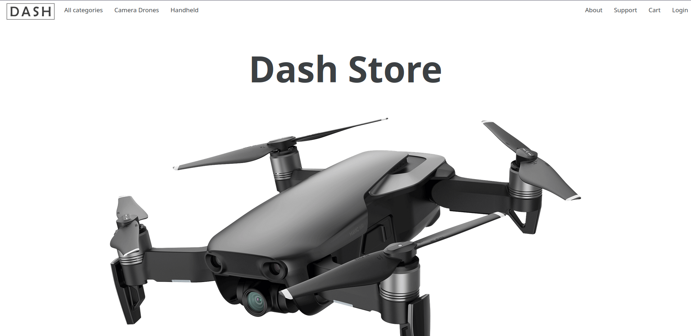
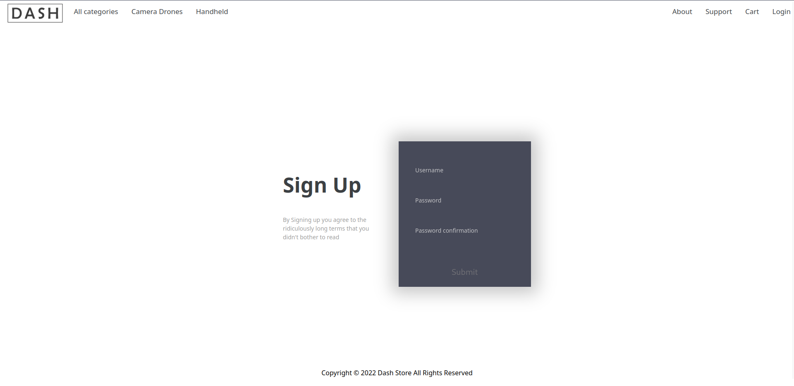
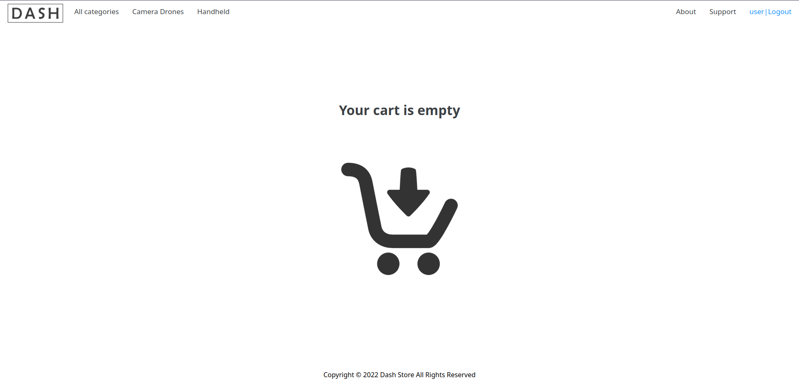
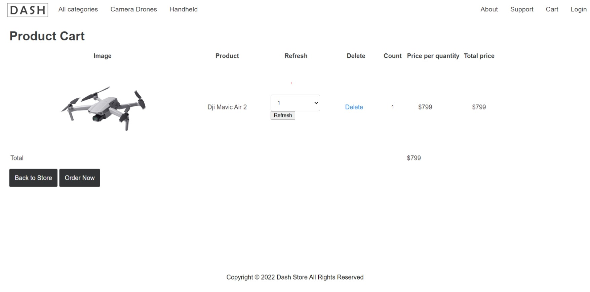
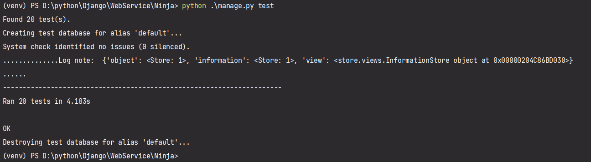

### Содержание
  1. [Введение](#1)
  2. [Объект тестирования](#2)
  3. [Атрибуты качества](#3)
  4. [Риски](#4)
  5. [Аспекты тестирования](#5) 
  6. [Подходы к тестированию и их реализация](#6)
  7. [Представление результатов](#7)
  8. [Выводы](#8)

### 1. Введение

Данный план предназначен для тестирования приложения "Dash". Цель проведения тестирования - проверка работоспособности и пригодности приложения для практического использования ручным способом, а также автоматическое тестировани отдельных компонентов пользовательского интерфейса и их совместного использования

### 2. Объект тестирования

В качестве объектов тестирования можно выделить атрибуты качества платформы по ISO 25010:

1. функциональность

	- функциональная полнота: приложение должно выполнять все заявленные функции
	- функциональная корректность: приложение должно выполнять все заявленные функции корректно
	- функциональная целесообразность: отсутствуют не заявленные функции, которые бы мешали приложению выполнять первоначально поставленные задачи

2. удобство использования

	- эстетика пользовательского интерфейса: элементы управления объектами должны быть всегда доступны пользователю
	- уведомление пользователя о неправильных действиях: приложение должно сообщать пользователю об ошибках и о неправильном использовании

### 3. Атрибуты качества

1. Функциональность:

    - функциональная полнота: приложение должно соответствовать всем функциональным требованиям, заявленных в [SDS]([../SDS]);
    - функциональная целесообразность: отсутствуют не заявленные функции, которые бы мешали приложению выполнять поставленные задачи
    
2. Удобство использования:

    - простота пользовательского интерфейса: интерфейс должен быть достаточно простым для интуитивного использования новым пользователем
    
3. Кроссплатформенность:

    - корректная работа приложения на платформах:
      - Windows
      - Linux.
      
4. Адаптивность

    - возможность комфортного использования приложения как на компьютере.

### 4. Риски
Приложение не использует функций и особенностей конкретных веб-браузеров, возможно использование во всех веб-браузерах , указанных в SRS, начиная с указанных версий.

### 5. Аспекты тестирования

Для проведения тестирования приложения необходимо определить каким образом оно будет происходить. Для лучшего понимания рассмотрим основные виды тестирования.

1. Автоматизированное тестирование
2. Ручное тестирование

Автоматизированное тестирование программного обеспечения — часть процесса тестирования на этапе контроля качества в процессе разработки программного обеспечения. Оно производится с помощью специальных библиотек и фреймворков для тестирования.

Ручное тестирование — часть процесса тестирования на этапе контроля качества в процессе разработки программного обеспечения. Оно производится тестировщиком без использования программных средств, для проверки программы или сайта путём моделирования действий пользователя.

Автоматизированное тестирование можно разделить на несколь подвидов:

1. Юнит тестирование
2. Интеграционное тестирование
3. Енд-ту-енд тестирование

Юнит тестирование проводится для тестирования отдельных блоков или компонентов приложения в полной изоляции.
Интеграционное тестирование проводится для тестирования работы взаимодействия отдельных компонентов приложения.
Енд-ту-енд тестирование это полноценное тестирование приложение с имитацией всех возможных действий пользователя на странице.

Данное приложение будет тестироваться ручным способом, а также автоматизированно с помощью юнит и интеграционных тестов.

### 6. Подходы к тестированию и их реализация

Проведём тестировани тестирование процесса регистрации ручным способом при запуске приложения локально:

Для запуска приложения переходим по ссылке http://127.0.0.1:8000/ и попадаем на главную страницу приложения. 

На главной странице мы видим, что представлены сниппеты пользователей и на верхней панели есть опция для перехода на страницу входа аккаунт. Выбираем этот пункт и попадаем на страницу входа, где представлена форма для входа в аккаунта.

Слева от полей ввода есть опция для перехода на страницу для регистрации. Выбираем этот пункт и попадаем на страницу регистрации, где представлена форма для создания аккаунта.

Если данные будет введены неверно, т.е. не будут соответствовать схеме, указанной в SRS, то под полями ввода должны появиться собщения об ошибке ввода.

Вводим данные верно и нажимаем на кнопку регистрации. После этого вход в систему осуществляется автоматически. В правом верхнем углу доступна кнопка для выхода их аккаунта и кнопка перехода в корзину.

После нажатия на имя пользователя происходит переход в корзину.

После нажатия на кнопку добавить в корзину, товар появляется в корзине:

Как упомяналось выше представлены юнит. Как среда для запуска юнит тестов был использован PyCharm. Для реализации тестов были использованы средства фреймворка Django.

Рассмотрим юнит тесты:

Для того чтобы протестировать данный компонент нужно проверить следующие варианты
его поведения:
- переход по всем возможным url-адресам
- отрисовка всех иконок
- удаление товара из корзины, если нажата кнопка "Delete"
- регистрация пользователя при корректно указанных полях
- выдача ошибки регистрации при некорректно введенных данных
- авторизация пользователя при корректно заполненных полях
- ошибка авторизации при некорректно введенных данных

### 7. Представление результатов

Посмотрим на результаты юнит тестов. Как видим тесты проходят:

Для запуска всех автоматизированных тестов в корне проекта в консоли нужно ввести команду "python manage.py test".

### 8. Выводы
Данный тестовый план позволяет протестировать основной функционал приложения. Успешное прохождение всех тестов не гарантирует полной работоспособности на всех платформах и архитектурах, однако позволяет полагать, что данное программное обеспечение работает корректно.
